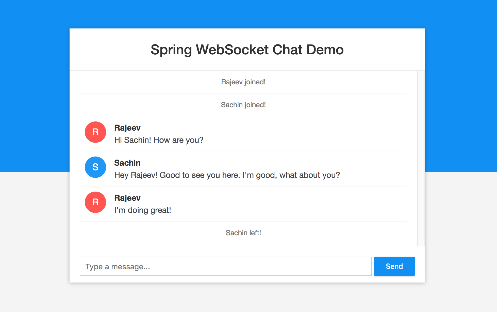

# Spring Boot Chat Application

A real-time chat application developed using Spring Boot and WebSocket technology.

This project enables multiple users to communicate instantly through WebSocket-based messaging with a responsive web interface.

---

# Features

- Real-time messaging
- WebSocket communication
- User join and leave notifications
- Responsive chat interface
- Event-driven communication
- REST API integration
- Docker support
- Kubernetes deployment configuration

---

# Technologies Used

- Java 11
- Spring Boot
- WebSocket
- HTML/CSS
- JavaScript
- Maven
- Docker

---

# Project Structure

```text
src/
 ├── config/
 ├── controller/
 ├── model/
 ├── static/
 └── resources/
```

---

# Requirements

- Java 11+
- Maven 3+

---

# How to Run

## Run Using Maven

```bash
mvn spring-boot:run
```

## Alternative Method

```bash
mvn package
java -jar target/websocket-demo-0.0.1-SNAPSHOT.jar
```

---

# Application URL

```text
http://localhost:8080
```

---

# Screenshots



---

# Future Improvements

- User authentication
- Private messaging
- Group chat functionality
- Database message persistence
- Online user tracking

---

# Learning Outcomes

This project helped in understanding:

- WebSocket communication
- Real-time application development
- Spring Boot backend architecture
- Event-driven messaging systems
- Docker deployment basics

---

# Customization and Enhancements

This project was customized and enhanced for learning and development purposes, including configuration updates and deployment support.

---

# Original Reference

Inspired by WebSocket chat application tutorials and Spring Boot real-time communication examples.

---

# Developed By

Sruthi Shakhamuri
